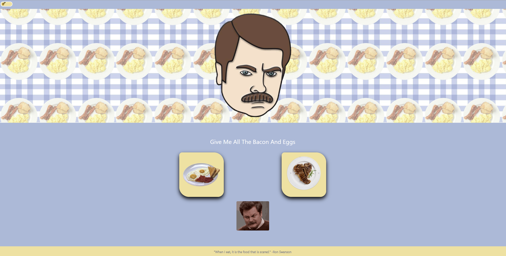
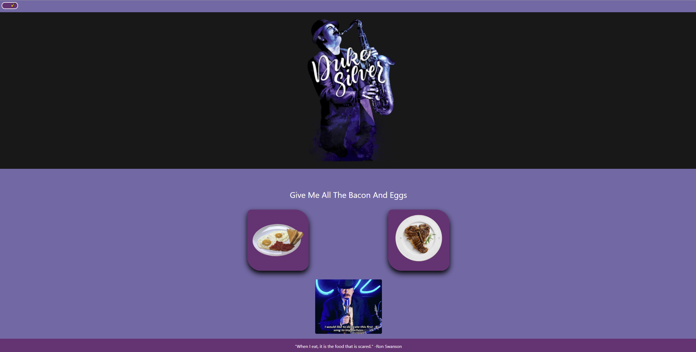
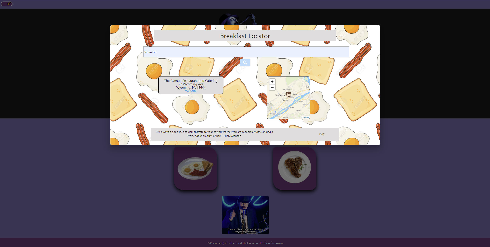
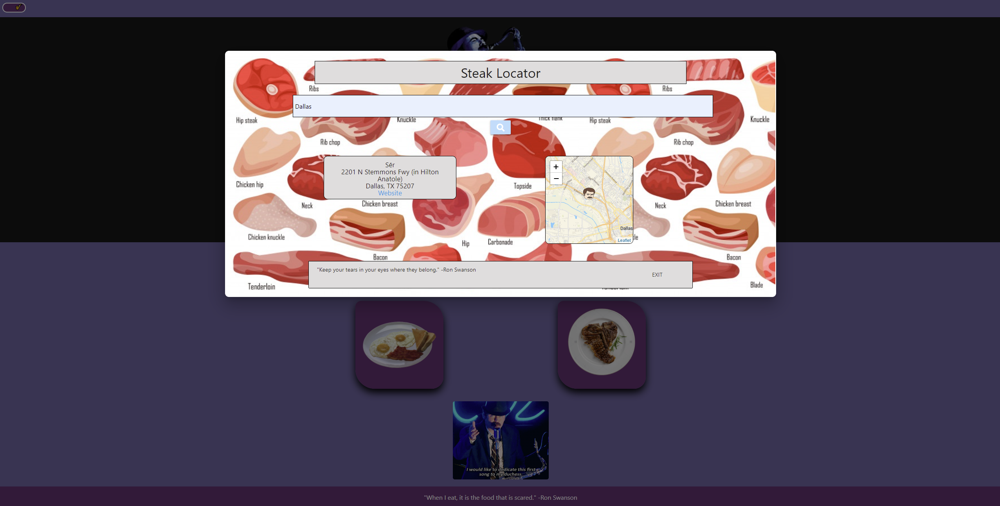

# Project 1: Ron's Grub Hub

## Project Description

Conceive and execute a design that solves a real-world problem by integrating data received from multiple server-side API requests while working collaboratively, and learning agile development methodologies and implement feature and bug fixes using the git branch workflow and pull requests.

\*\*\* Please note that the API key for this application has been removed from the repository for security. Therefore, this application does not function at the deployed link.

## User Story

```
I Ron Swanson, a true purveyor of the only meals that truly matter. Breakfast and steak.

I will assist you in your journey to finding where you too can find all the eggs and bacon and steak.

Just fill in your city and search.

It's really that simple.
```

## Acceptance Criteria

```
GIVEN I am searching for a breakfast or steak restaurant
WHEN I click the toggle switch
THEN I can choose between Ron Swanson mode and Duke Silver Mode
WHEN I choose breakfast or steak
THEN I fill in my city name
WHEN I click search
THEN a restaurant, its address, a map of its location, and a quote from Ron will generate
WHEN I click EXIT I can go back to the homepage and choose a meal type again
```

### To start looking for your next breakfast or steak meal [click here](https://klay824.github.io/project-1/).

<br />

## APIs Utilized

- [FourSquare Places](https://developer.foursquare.com/docs/places-api/)
- [Leaflet](https://leafletjs.com/)
- [Ron Swanson Randon Quote API](https://github.com/jamesseanwright/ron-swanson-quotes)

## Bootstrap-Alternative CSS Framework Utilized

- [Materialize CSS](https://materializecss.com/)

## Resources

- [FourSquare Places Documentation](https://developer.foursquare.com/docs/places-api/endpoints/)
- [Leaflet Documentation](https://leafletjs.com/reference-1.7.1.html)
- [Ron Swanson Quote Documentation](https://github.com/jamesseanwright/ron-swanson-quotes)
- [Materialize Documentation](https://materializecss.com/)
- [Stack Overflow Search for overriding Materialize](https://stackoverflow.com/questions/36792910/override-materialize-css-properties)
- [Stack Overflow for removing whitespace from responsive image](https://stackoverflow.com/questions/44011931/why-is-my-responsive-background-image-leaving-white-space-at-the-bottom-of-the-i)
- [W3Schools Toggle Switch Documentation](https://www.w3schools.com/howto/howto_css_switch.asp)
- [Switching beteen CSS stylesheets with JavaScript](https://stackoverflow.com/questions/7846980/how-do-i-switch-my-css-stylesheet-using-jquery)
- [Saving stylesheet changes to local storage](https://www.youtube.com/watch?v=wodWDIdV9BY)

## Team Responsibilities Break Down

- [Katie Patterson](https://github.com/ktp1451): Webpage design, wireframe, HTML, CSS, Materialize
- [Alexander Vadeboncoeur](https://github.com/Alexva397): Leaflet API functionality and integration with the restaurant coordinates from FourSquare to generate a map for each restaurant search; additional Materialize and CSS styling
- [JP Eiler](https://github.com/jpeiler97): FourSquare API functionality and assistance with integration with Leaflet; additional Materialize and CSS styling
- [Katy Chadwell](https://github.com/klay824): Modal functionality, Ron Swanson Random Quote API functionality, Ron/Duke theme toggle switch design and functionality, additional Materialize and CSS styling

## Challenges

We initially wanted to use DocuMenu API to search for restaurants, but unfortunately it had a 500 per month call limit. We then looked at Yelp! API but it was not CORS compatible. We finally discovered FourSquare Places which fit our needs to locate a restaurant and we could use the coordinates from FourSquare to fetch a map from the Leaflet API. Another challenge was using the Materialize CSS. The documentation seems sparse and we found more information about Materialize through Googling. Materialize also interfered with some of our custom CSS.

## Application Demo


## Screenshots








